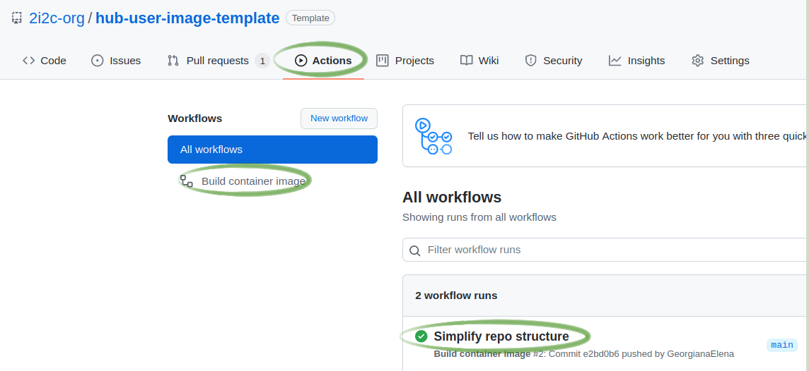

# hub-user-image-template

This is a template repository for creating dedicated user images for our hubs. The overall workflow is to 

1. Fork this repository to create your image repository
2. Hook your image repository to quay.io
3. Customize the image by editing repo2docker files in your image repository.  
   - Changes can either be done by direct commits to main on your image repository, or through a pull request from a fork of your image repository. Direct commits will build the image and push it to Quay.io. PRs will build the image and offer a link to test it using Binder. Merging the PR will cause a commit on main and therefore trigger a build and push to Quay.io.
4. Configure your Hub to use this new image.

The steps are explained in detail below.

## About this template repository

* It enables [jupyterhub/repo2docker-action](https://github.com/jupyterhub/repo2docker-action).
  This GitHub action builds a Docker image using the contents of this repo and pushes it to the [Quay.io](https://quay.io/) registry.

* It provides an example of a `environment.yml` conda configuration file.
  This file can be used to list all the conda packages that need to be installed by `repo2docker` in 
  your environment.
  The `repo2docker-action` will update the [base repo2docker](https://github.com/jupyterhub/repo2docker/blob/HEAD/repo2docker/buildpacks/conda/environment.yml)
  conda environment with the packages listed in this `environment.yml` file.

**Note:**
A complete list of possible configuration files that can be added to the repository and be used by repo2docker to build the Docker image, can be found in the [repo2docker docs](https://repo2docker.readthedocs.io/en/latest/config_files.html#configuration-files).

## How to create and use a custom user image for your hub

### 1. Use this template

Create a new repository from `hub-user-image-template` repository, by clicking the *Use this template* button located at the top of this project's GitHub page.

### 2. Hook the new repository to [quay.io](https://quay.io/)

Follow all the instructions (except the last step), provided by the [repo2docker-action docs](https://github.com/jupyterhub/repo2docker-action#push-repo2docker-image-to-quayio) on how to allow the built image to be pushed to [quay.io](https://quay.io/).

When you have completed these steps, you should have:

* a quay.io repository of the form `quay.io/<quay-username>/<repository-name>`
* two GitHub secrets **QUAY_USERNAME** (the user name of the `quay.io` robot account) and **QUAY_PASSWORD** (the password of the `quay.io` robot account) set on your newly created GitHub repository.

  

### 3. Update workflow config to push the image to quay.io

Step 2 should have provided the appropriate credentials to push the image to quay.io. But the `IMAGE_NAME` option also has to be configured for the push to quay.io to happen. Since this template repository provides two GitHub workflows that can build and push the image to quay.io, below are the steps to configure `IMAGE_NAME` for each of them.

#### Enable quay.io image push for [build.yaml](https://github.com/2i2c-org/hub-user-image-template/blob/main/.github/workflows/build.yaml)

The [build.yaml](https://github.com/2i2c-org/hub-user-image-template/blob/main/.github/workflows/build.yaml) workflow builds the container image and pushes it to quay.io **if** credentials and image name are properly set. This happens on every pushed commit on the main branch of the repo (including when a PR is merged).

To enable pushing to the appropriate quay.io repository, edit line 35 of [build.yaml](https://github.com/2i2c-org/hub-user-image-template/blob/main/.github/workflows/build.yaml#L34-L35) and:

* uncomment the `IMAGE_NAME` option
* replace `<quay-username>/<repository-name>` with the info of the `quay.io` repository created at step 2
* commit the changes you've made to `build.yaml`

If you want to see the log of the Github Action that results you can see this via the Github Actions tab on your image repository. If you are triggering this action by merging a PR you should look at the Github Actions tab (and this will show "pushing quay.io/..."). The build log linked from the PR page is not the one for the merge, but the build done for the PR, prior to the merge (and will therefore, by default, not show "pushing quay.io/..."). 

#### Enable quay.io image push for [test.yaml](https://github.com/2i2c-org/hub-user-image-template/blob/MAIN/.github/workflows/test.yaml)

The [test.yaml](https://github.com/2i2c-org/hub-user-image-template/blob/MAIN/.github/workflows/test.yaml) workflow builds the container image on pull requests. It can also push it to quay.io **if** credentials, image name are correctly set and [`NO_PUSH`](https://github.com/jupyterhub/repo2docker-action#optional-inputs) option is removed.

To enable pushing to the appropriate quay.io repository:

* edit lines 31 of [test.yaml](https://github.com/2i2c-org/hub-user-image-template/blob/MAIN/.github/workflows/test.yaml#L30-L31) and:
  * uncomment the `IMAGE_NAME` option
  * replace `<quay-username>/<repository-name>` with the info of the `quay.io` repository created at step 2
  * commit the changes you've made to `build.yaml`

* **IF** you want to also push the image on Pull Request commits, then edit lines 27 of [test.yaml](https://github.com/2i2c-org/hub-user-image-template/blob/main/.github/workflows/test.yaml#L27) and remove the `NO_PUSH: "true"` line. This will disable verbose mode and push the image to the registry instead.

The [Optional Inputs](https://github.com/jupyterhub/repo2docker-action#optional-inputs) section in the [jupyterhub/repo2docker-action](https://github.com/jupyterhub/repo2docker-action) docs provides more details about the `NO_PUSH` option, alongside additional inputs that can also be passed to the repo2docker-action.

### 4. Define the environment wanted

* Modify [the environment.yml](https://github.com/2i2c-org/hub-user-image-template/blob/main/environment.yml) file and add all the packages you want installed in the conda environment. Note that repo2docker already installs [this list](https://github.com/jupyterhub/repo2docker/blob/HEAD/repo2docker/buildpacks/conda/environment.yml) of packages. More about what you can do with `environment.yml`, can be found in the [repo2docker docs](https://repo2docker.readthedocs.io/en/latest/config_files.html#environment-yml-install-a-conda-environment).

* Commit the changes made to `environment.yml`.

* Create a pull request with this commit, or push it dirrectly to the `main` branch.

* If you merge the PR above or directly push the commit to the `main` branch, the GitHub Action will automatically build and push the container image. Wait for this action to finish.

### 5. Build and push the image of the repository

Images generated by this action are automatically tagged with both latest and `<SHA>` corresponding to the relevant commit SHA on GitHub. Both tags are pushed to the image registry specified by the user. If an existing image with the *latest* tag already exists in your registry, this Action attempts to pull that image as a cache to reduce uncessary build steps.

Checkout an example of a [quay.io respository](https://quay.io/repository/2i2c/coessing-image?tab=tags) that hosts the user environment image of a 2i2c hub.

### 6. Connect the hub with this user image

* Go to the list of image tags on `quay.io`, and find the tag of the last push. This is not the latest tag but is usually under it. Use this to construct your image name - `quay.io/<quay-username>/<repository-name>:<tag>`.

  

* Open the [Configurator](https://pilot.2i2c.org/en/latest/admin/howto/configurator.html) for the hub (you need to be logged in as an admin).
  You can access it from the hub control panel, under Services in the top bar or by going to https://<hub-address>/services/configurator/

  

* Make a note of the current image name there.

* Put the image tag you constructed in a previous step into the User docker image text box.

* Click Submit! *this is alpha level software, so there is no 'has it saved' indicator yet :)*

You can find more information about the Configurator [here](https://pilot.2i2c.org/en/latest/admin/howto/configurator.html).

### 7. Test the new image

Test the new image by starting a new user server! If you already had one running, you need to stop and start it again to test.
If you find new issues, you can revert back to the previous image by entering the old image name, back in the JupyterHub Configurator.

*This will be streamlined in the future.*

## Push image to a registry other than Quay.io

The [jupyterhub/repo2docker-action](https://github.com/jupyterhub/repo2docker-action) can build and push the image to registries other than [Quay.io](https://quay.io/). Checkout the [action docs](https://github.com/jupyterhub/repo2docker-action/blob/master/README.md) for the instructions on how to setup your workflow to push to: [AWS Elastic Container Registry](https://github.com/jupyterhub/repo2docker-action#push-repo2docker-image-to-amazon-ecr), [Google Container Registry](https://github.com/jupyterhub/repo2docker-action#push-repo2docker-image-to-google-container-registry) (deprecated but popular), [Google Artifact Registry](https://github.com/jupyterhub/repo2docker-action#push-repo2docker-image-to-google-artifact-registry) (preferred), [Azure Container Registry](https://github.com/jupyterhub/repo2docker-action#push-repo2docker-image-to-azure-container-registry).

**Note:**
For cloud provider-specific registries, if we are running the cluster on our projects, please contact the 2i2c team to give you credentials for it.
